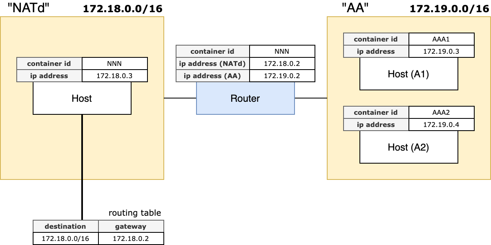

## Description
A simple NAT simulation using Docker


## Example



Create two docker networks, one of which is for NATted network:
```
docker network create NATd
docker network create AA
```

Run a router with network names. The first must be of NATted network
```
./run_router.sh NATd AA
# Prints:
# 	Container ID (say, "RRR")
# 	IP Addresses (say, "172.18.0.2", "172.19.0.2", ...)
```

Run a NATted host
```
./run_host.sh NATd RRR
# Prints:
# 	Container ID (say, "NNN")
# 	IP Address   (say, "172.18.0.3")
```

Update the routing table of NNN for it to be able to access the AA network
```
./add_route.sh NNN AA
```

Run two hosts on the AA network
```
# Host A1
./run_host.sh AA RRR
# Prints:
# 	Container ID (say, "AAA1")
# 	IP Address   (say, "172.19.0.3")

# Host A2
./run_host.sh AA RRR
# Prints:
# 	Container ID (say, "AAA2")
# 	IP Address   (say, "172.19.0.4")
```

In the NATted host, `ping` to confirm routing works
```
docker exec -t NNN ping -c 4 172.19.0.3
docker exec -t NNN ping -c 4 172.19.0.4
```

Execute two `ncat` servers on A1 and A2
```
# shell 1
docker exec -it AAA1 ncat -vk -l 80 -c 'xargs -n1 echo Echo from AAA1: '

# shell 2
docker exec -it AAA2 ncat -vk -l 80 -c 'xargs -n1 echo Echo from AAA2: '
```

Finally, for each `ncat` server, execute an `ncat` client that connects it, specifying a specific source port.
```
# shell 3
docker exec -it NNN ncat -v -p 45678 172.19.0.3 80

# shell 4
docker exec -it NNN ncat -v -p 45678 172.19.0.4 80
```

Each `ncat` server shows the same result, meaning that NAT is done in endpoint-independent way.
```
# From shell 3 and 4
Ncat: Version 7.70 ( https://nmap.org/ncat )
Ncat: Listening on :::80
Ncat: Listening on 0.0.0.0:80
Ncat: Connection from 172.19.0.2
Ncat: Connection from 172.19.0.2:45678.
```

> Why `iptables` chooses the same port number as the private endpoint?

It seems that the NAT of `iptables` tests the identical one first by default.
To confirm that it _really_ reuses the port mapping, not blindly choosing the identical number, I ran another NATted host,
followed the above steps again. The `iptables` _did_ reuse the port mapping: it picked a random available port:
```
# From shell 3 and 4
Ncat: Version 7.70 ( https://nmap.org/ncat )
Ncat: Listening on :::80
Ncat: Listening on 0.0.0.0:80
Ncat: Connection from 172.19.0.2.
Ncat: Connection from 172.19.0.2:45678.
Ncat: Connection from 172.19.0.2
Ncat: Connection from 172.19.0.2:1024.
```


## Copy&Paste
Print docker networks overview
```
docker network inspect -f '{{json .Name}} {{json .IPAM}} {{json .Containers }}' <name1> <name2> ... | jq
```

## Retrospect
- I wasted my time finding out why `-j LOG` does not log anything on anywhere.
It turns out that `-j LOG` [does not work at all][docker-log-target] in a Docker container.
- I (again) wasted my time finding out if there is any way to log packets _after_ the translation.
I gave up and realized “why not just use `ncat` on hosts...?”, which also implies that the `iptables` logging is useless.
- [just a note](./NOTE.md)


## References
- https://www.tecmint.com/setup-linux-as-router/
- https://serverfault.com/questions/981952/centos-7-how-to-get-interface-name-by-macaddress
- https://hangarau.space/running-and-debugging-iptables-inside-a-docker-container/


[docker-log-target]: https://hangarau.space/running-and-debugging-iptables-inside-a-docker-container/#logging
